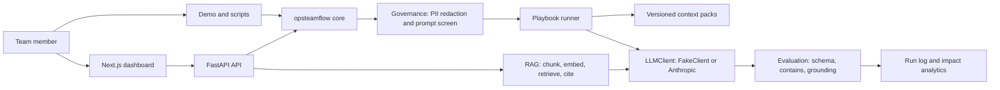

# OpsTeamFlow AI

An operating system for how a team uses AI.

Most teams now have AI tools. What they do not have is a shared, inspectable way
of using them: the same prompt produces different quality in different hands, no
one can say whether an output is grounded in real sources, sensitive data leaks
into prompts by accident, and nobody can answer "is this actually saving us
time" with a number instead of a feeling.

OpsTeamFlow AI is the layer that fixes that. It is a Python library (with an
optional HTTP API and dashboard) that gives a team six things that work
together:

- **Context packs** — versioned, fingerprinted bundles of reference text
  (product facts, support policy, tone rules) that any workflow can pull in.
- **Playbooks** — a recurring AI task written as a YAML file that carries its
  own success checks, so "how we know it works" lives in the artifact.
- **RAG with citations** — ingest documents, retrieve the relevant chunks,
  answer with the source ids attached.
- **Guarded agents** — a small, sequential, fully inspectable agent runner.
- **Evaluation** — grounding, schema, and keyword scorers plus a regression
  runner you wire into CI.
- **Analytics** — an append-only run log that turns adoption and time-saved
  into real aggregates.

## Why this exists

I kept watching good teams adopt AI and then quietly distrust it. The tools were
fine. The missing piece was operational: no standard context, no checks, no
measurement, no guardrails. So a prompt that worked for one person broke for the
next, and "is the AI any good here" stayed a matter of opinion.

I built OpsTeamFlow AI to make AI usage a system property instead of a personal
skill. The design rule throughout: **anything the system claims, it must be able
to show.** That is why there are no invented metrics anywhere in this repo. The
numbers you see come from running the code.

## Runs with no API key

The whole system runs offline. Every module depends on a small `LLMClient`
interface with two implementations: a real Anthropic client, and a
deterministic `FakeClient` that needs no network and no key. This is what makes
the test suite and the demo runnable anywhere, and it is also how contributors
work locally without spending money.

Add `ANTHROPIC_API_KEY` to your environment and the exact same code paths call a
real model instead. Nothing else changes.

## Quickstart

```bash
git clone <your-fork-url> opsteamflow-ai && cd opsteamflow-ai
python -m venv .venv && source .venv/bin/activate
pip install -e ".[dev]"      # core + pytest, no model needed

pytest -q                    # 21 tests, fully offline
python scripts/demo.py       # end-to-end tour of all six subsystems
```

To use a real model:

```bash
pip install -e ".[llm]"
export ANTHROPIC_API_KEY=sk-...
python scripts/demo.py       # now prints: LLM client in use: AnthropicClient
```

Optional HTTP API:

```bash
pip install -e ".[api]"
uvicorn opsteamflow.api.app:app --reload
# POST /rag/ask, /playbook/run, /governance/redact, GET /analytics/summary
```

## Architecture



Each subsystem is independent and importable on its own. The arrows are the
common path: a playbook redacts and screens input (governance), assembles
context packs (context), calls the model (LLMClient), scores the result (eval),
and the run is logged (analytics).

See `docs/architecture.md` for the longer version and `docs/adr/` for the
decisions behind the tradeoffs.

## What a playbook looks like

```yaml
name: support_reply
goal: Draft a support reply that follows policy and never invents account data.
context_packs: [support_policy]
inputs: [customer_message]
system: You are a careful support agent. Follow the provided policy exactly.
prompt_template: |
  A customer wrote the following message. Draft a reply that follows the
  support policy in the context above. Offer one clear next step.

  CUSTOMER MESSAGE:
  {customer_message}
checks:
  contains: [next step]
  min_grounding: 0.2
```

Running it validates the inputs, blocks prompt-injection, redacts PII, loads the
`support_policy` pack under a token budget, calls the model, and scores the
output against the `checks`. A playbook that does not meet its own checks is a
failed run, and that shows up in analytics and in CI.

## Results

These are produced by `python scripts/demo.py`, captured verbatim in
`docs/demo_output.txt`. Offline (FakeClient) numbers:

- Governance removed 3 PII spans (email, phone, credit card) from a sample
  message and blocked an injection attempt flagged as `override, system_leak`.
- The `release_note` playbook produced schema-valid JSON and passed its check.
- RAG ingested the handbook, retrieved the relevant chunk, and returned a
  citation (`handbook#0`).
- The agent workflow ran three agents in sequence without tripping a guardrail.
- The eval suite reported pass_rate 1.0 on its regression case.

The offline numbers exist to prove the plumbing. Real grounding and answer
quality require a real key; the eval harness is what you use to measure that
honestly rather than asserting it.

## Honest limitations

- **`grounding_score` is lexical overlap, not entailment.** It catches answers
  that drift off-source and works as a CI tripwire. It will be fooled by a
  fluent paraphrase (false low) or a confident lie that reuses source words
  (false high). It is a proxy and the code says so.
- **`FakeClient` is a fixture, not a model.** It returns deterministic,
  structurally valid output so the system is testable offline. It tells you
  nothing about real answer quality.
- **The vector store is in-memory cosine** over a hashed embedder. It is correct
  and dependency-free, deliberately swappable for Chroma/Pinecone behind the
  `VectorStore` interface, and not meant for millions of documents as written.
- **Token counting is `len/4`,** good enough for budgeting, not exact.

## Tests

```bash
pytest -q     # 21 tests across all six subsystems, no key required
```

## Roadmap

See `docs/roadmap.md`. Short version: real embedder adapter, a proper eval set
with labeled grounding judgments, per-team budgets in the API, and a Postgres
analytics backend (schema already in `docs/schema.sql`).

## License

MIT.

