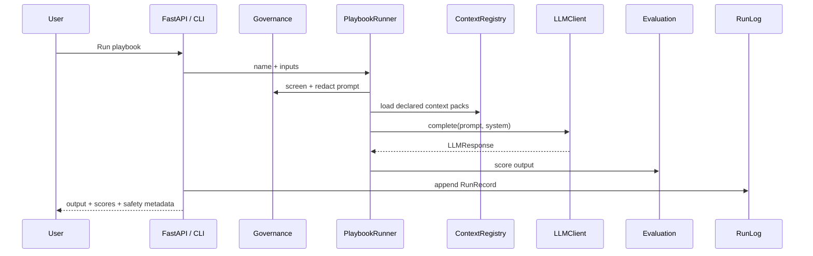

# Architecture

OpsTeamFlow AI is library-first. The HTTP API and the dashboard are optional
shells around the Python package.

## Core interface

Every model-facing subsystem depends on one small protocol:

```python
class LLMClient(Protocol):
    def complete(
        self,
        prompt: str,
        *,
        system: str | None = None,
        max_tokens: int = 1024,
        temperature: float = 0.0,
    ) -> LLMResponse: ...
```

Two clients implement it:

- `FakeClient`: deterministic and offline for demos, tests, and CI.
- `AnthropicClient`: real model calls when `ANTHROPIC_API_KEY` is available.

This keeps the system testable without network access or model spend.

## Request path



## Subsystems

### context

Context packs are YAML files with a name, kind, version, tags, and body. Each
pack gets a short SHA-256 fingerprint so a run can show exactly which reference
text was used.

### governance

`screen` blocks obvious prompt-injection and secret-exfiltration patterns.
`redact` replaces common PII patterns with typed placeholders. Both are pure
string functions and can run before every model call.

### playbook

A playbook is a reusable AI task. It declares required inputs, optional context
packs, a prompt template, a system instruction, and success checks. A run returns
output, scores, redaction counts, safety flags, and context manifest.

### rag

The RAG pipeline chunks text, embeds it with a deterministic hashing embedder,
retrieves by cosine similarity, asks the model with bracketed chunk IDs, and
extracts citations from the output.

### eval

The eval layer includes three small scorers: JSON schema, phrase containment,
and lexical grounding. They are not perfect quality metrics, but they are useful
regression checks.

### analytics

Run records are appended to JSONL and aggregated by workflow. The system reports
only measured time saved when a manual baseline is explicitly provided.

## Scaling notes

The current implementation is designed for a credible MVP and portfolio demo.
For production, replace the in-memory vector store with a managed vector DB,
move JSONL analytics to Postgres, add stronger API auth/rate limiting, and track
playbook versions in each run record.
